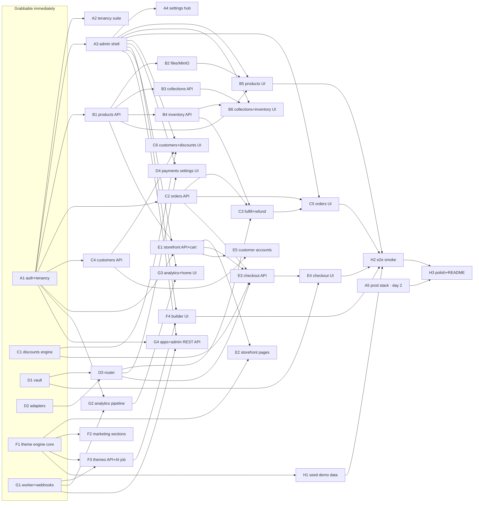

# Issue backlog — how the agent swarm works

This directory is the development plan, broken into parallel-safe issues.
Each `NN-ws{x}-*.md` file is one unit of work an agent picks up, finishes, and
lands as **one PR**. Everything an agent needs is in the issue file plus the
canon documents: [SPEC.md](../../SPEC.md) (what to build),
[CLAUDE.md](../../CLAUDE.md) (how to work), [WORKSTREAMS.md](../WORKSTREAMS.md)
(what you own), and for anything with a screen, [PARITY.md](PARITY.md)
(what Shopify actually looks like — binding for UI issues).

**KPI reminder: a Shopify user opens the admin and cannot tell it isn't
Shopify.** Every issue exists to serve that. Trade-offs resolve: appearance
parity → functionality → performance → everything else.

---

## The loop (per issue)

```bash
# 1. CLAIM — append one line to docs/AGENT-LOG.md (merge=union, append-only):
#    2026-08-28T10:15Z | <agent-name> | CLAIM B1 | branch ws-b/products-api
git fetch origin && git rebase origin/main
git switch -c ws-{x}/{issue-slug}

# 2. TESTS FIRST — write the tests named in the issue's "Test plan" section
#    before or alongside the implementation. Red → green → refactor.

# 3. VERIFY — before every push:
pnpm verify          # biome + typecheck + unit
# plus the issue's own acceptance commands (run them, don't assume)

# 4. LAND
git push -u origin ws-{x}/{issue-slug}
gh pr create --fill --label ws-{x}
gh pr merge --auto --squash --delete-branch

# 5. LOG — append: ... | DONE B1 | PR #NN
#    then immediately claim the next unblocked issue. Do NOT poll the PR;
#    sweep it at the start of your next loop:
gh pr list --author @me --state open --json number,title,mergeable,labels
#    `mergeable: CONFLICTING`, a `needs-rebase` label, or NO CHECKS AT ALL all
#    mean the same thing — GitHub cannot merge it, so pr-checks never started.
pnpm sync    # rebases onto main and pushes; that is the whole fix
```

Rules that make this safe with many agents in flight (full detail in
[PARALLEL-AGENTS.md](../PARALLEL-AGENTS.md)):

- **One issue = one PR.** If an issue turns out to need two PRs, that's fine —
  land the first as soon as it stands alone. Never batch two issues into one PR.
- **Claim before you start.** If AGENT-LOG.md shows an unfinished claim on the
  issue less than ~3h old, pick a different issue. Stale claims (>3h, no PR) may
  be re-claimed — log that you're doing so.
- **Stay inside the issue's "You own" paths.** Need something owned elsewhere?
  Type it in `packages/contracts`, stub it, note it in `DECISIONS.md`, keep going.
- **Never relitigate** anything already in `DECISIONS.md`.
- **`pnpm setup:git` once per clone** — installs the merge drivers; without it
  every lockfile touch conflicts.

## Test-driven, feedback-based

Tests here are scoped by SPEC §14 — they exist to prove the demo works, not for
coverage. Every issue names its test plan. The discipline:

1. Write the issue's tests first (or the Playwright flow, for UI issues) so you
   have a red bar.
2. Implement until green. Run the real thing — `pnpm dev` against the seeded
   stack — and look at the page/response before claiming done.
3. **Forbidden tests** (SPEC §14): snapshot tests, per-endpoint CRUD tests,
   mock-heavy glue tests, coverage targets. Don't write them even under TDD —
   the mandated suites are the feedback loop.

The mandatory blocking suites and where they live:

| Suite | Location | Issue |
|---|---|---|
| Tenancy isolation | `apps/api/test/tenancy.test.ts` | A2 |
| Pay unit (vault, router) | `packages/pay/test/**` | D1 |
| Money & discounts math | `apps/api/src/services/discounts` tests | C1 |
| Playwright smoke (5 flows) | `e2e/tests/**` | H2 |

## Issue file anatomy

Every issue has the same sections — read all of them before writing code:

- **Meta** — workstream, size (S ≈ ≤2h, M ≈ half-day, L ≈ full-day), what it
  depends on, what it unblocks.
- **You own** — the only paths you may edit (plus additive `contracts`/schema).
- **Context** — current state of the code, what exists, what's stubbed.
- **Build** — the deliverable, with SPEC § references.
- **Test plan** — the tests to write first and the acceptance commands to run.
- **Landmines** — the project-specific mistakes that cost hours.

## Dependency graph

Issues with no unmet dependencies are grabbable now. `A*` is the platform
spine; `C1`/`D1..3`/`F1` are pure-logic issues grabbable immediately in
parallel with it.



Full index with one-line summaries: [INDEX.md](INDEX.md).
